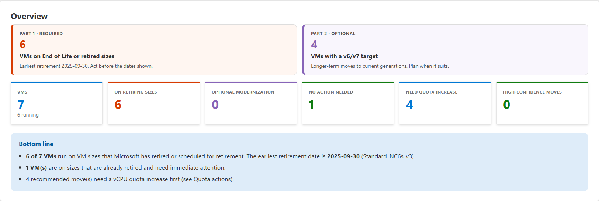
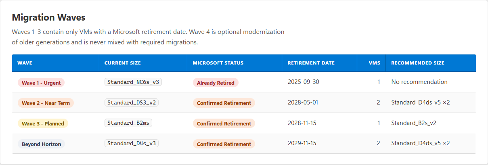
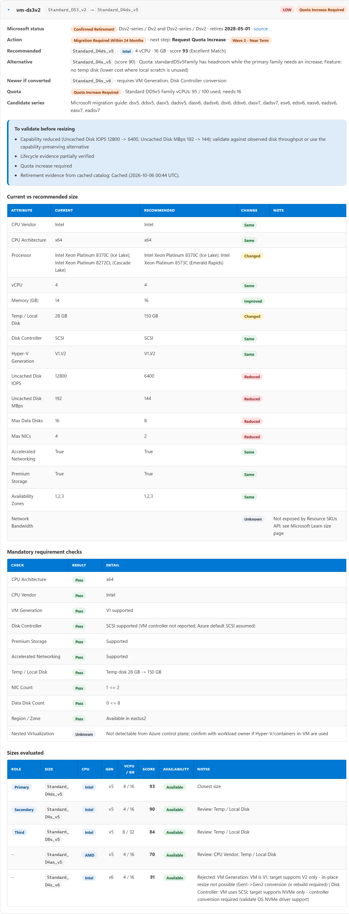
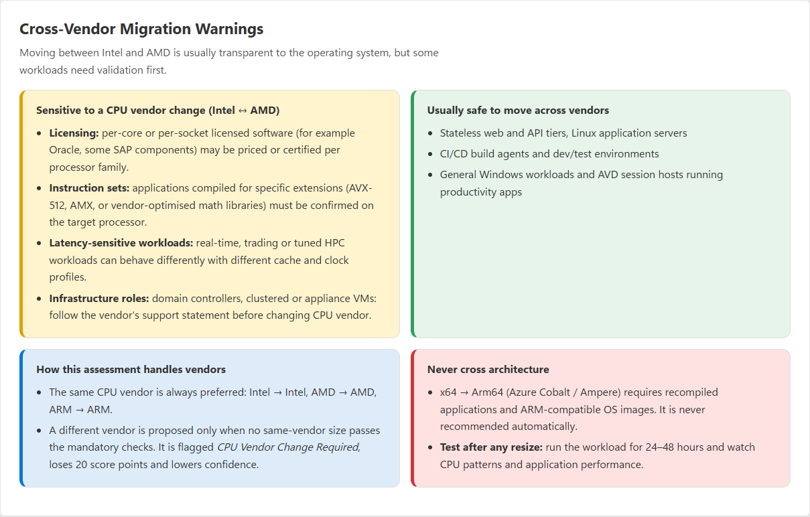
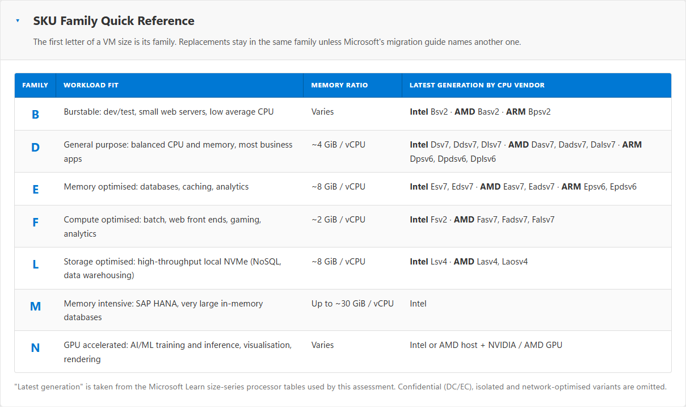
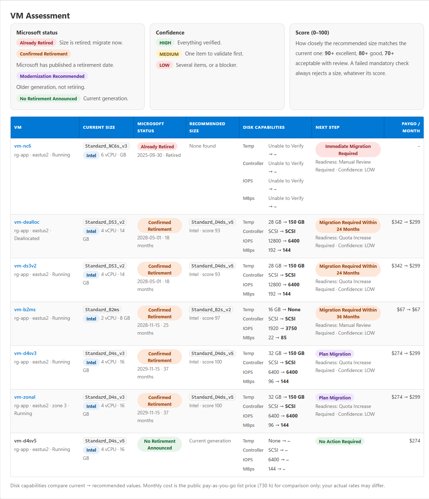
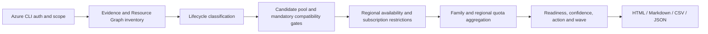

# VMSKURetirementReport

[](https://github.com/AzaryaShaulov/Azure/actions/workflows/vm-sku-retirement-report-ci.yml)
[](LICENSE)


**Evidence-based Azure VM SKU retirement and upgrade assessment**, packaged as an
[Agent Skill](https://agentskills.io) for GitHub Copilot, Claude Code and other agents, and also runnable
directly from PowerShell.

The tool scans every subscription you can read, finds VMs on sizes Microsoft has **retired or scheduled for
retirement**, and recommends the closest **current-generation, same-CPU-vendor** replacement. It validates each
recommendation against regional availability, subscription restrictions and VM-family quota. The output is an
auditable wave plan in HTML, Markdown, CSV and JSON.



## Why

- **"Old" is not "retired."** Retirement status and dates come only from Microsoft Learn. Older generations such as
  Esv4 that Microsoft has *not* scheduled for retirement are reported as **optional modernization**, never as urgent
  migrations. When Microsoft does announce a date (as it did for Dv3/Dsv3/Ev3/Esv3, retiring 2029-11-15), the
  assessment follows the evidence.
- **Nothing is guessed.** Unknowns are labelled `Unable to Verify` / `Unable to Confirm`, and each finding carries
  its Microsoft source URL.
- **Recommendations you can act on.** The tool keeps the CPU vendor and architecture, never downsizes, enforces
  mandatory compatibility checks (Hyper-V generation, SCSI/NVMe controller, temp disk, accelerated networking,
  Premium/Ultra, Trusted Launch and more), and adds up quota demand across every VM moving into the same family.
- **Strictly read-only.** It uses Azure CLI read operations to collect inventory, SKU availability/restrictions,
  quota usage and optional telemetry. It never resizes, redeploys, starts, stops or otherwise changes a VM, and it
  never requests quota increases or modifies Azure configuration.

## Features

| Area | What you get |
|---|---|
| Retirement evidence | Live Microsoft Learn retirements list, End of Life list and modernization guide, with provenance (URL, git commit, retrieval time); cached fallback |
| Inventory | Azure Resource Graph across all accessible subscriptions (paged, chunked), NIC / disk / encryption joins, Advisor and Service Health corroboration |
| Recommendations | Primary, alternative and third candidates; optional v7/v6 modernization assessment; "newer generation if converted"; 0-100 compatibility score; HIGH / MEDIUM / LOW confidence |
| Deployability | Region and zone availability, subscription SKU restrictions, family and regional quota with minimum and recommended increases |
| Planning | Waves 1-3 (retirements by urgency) and Wave 4 (optional modernization); action and next-step per VM |
| Extras | PAYGO price comparison (on by default, `-SkipPricing` to turn off) and an optional rightsizing signal from Azure Monitor (never changes the recommendation) |
| Outputs | Responsive HTML report, executive summary and per-VM detail (Markdown), CSV for Excel / Power BI, versioned JSON |

<table>
<tr>
<td></td>
<td></td>
</tr>
<tr>
<td></td>
<td></td>
</tr>
</table>

Browse the full generated sample in [`examples/sample-report/`](examples/sample-report/). It uses a synthetic
*Contoso* estate: open `index.html` locally.



## Local use

### Prerequisites

- [PowerShell 7.2+](https://learn.microsoft.com/powershell/scripting/install/installing-powershell) (`pwsh`) on
  Windows, Linux or macOS
- [Azure CLI 2.60+](https://learn.microsoft.com/cli/azure/install-azure-cli) (`az`)
- **Reader** on every subscription to assess; also **Monitoring Reader** when using `-IncludeRightsizing`
- Network access to Azure management endpoints and Microsoft Learn; `-OfflineCatalog` uses the bundled lifecycle
  evidence when Microsoft Learn is unavailable
- A browser for the generated HTML report

From PowerShell, sign in to the intended tenant, install the required Azure Resource Graph extension, and verify
both tools:

```powershell
pwsh --version
az version
az login --tenant <tenant-id>
az extension add --name resource-graph
az extension show --name resource-graph --output table
az account list --query "[?state=='Enabled'].{Name:name,Subscription:id,Tenant:tenantId}" --output table
```

All assessment calls are read-only. `az login` may update the Azure CLI's local sign-in cache, but the tool does not
write to the Azure tenant or its resources.

## Choose how to run it

| | Option | Use it when | Requires |
|---|---|---|---|
| 🅰️ | **Option A - VS Code + GitHub Copilot** | You want Copilot to interpret the request and run the skill for you | VS Code, GitHub Copilot, Azure CLI |
| 🅱️ | **Option B - Standalone PowerShell** | You want to run the scripts yourself from a terminal | PowerShell 7.2+, Azure CLI |

Both options run the exact same read-only assessment and produce the same reports.

---

## 🅰️ Option A - VS Code + GitHub Copilot skill

> **Use this option if you want GitHub Copilot in VS Code to run the assessment for you.**

### Step 1 - Install the tooling

Install [Visual Studio Code](https://code.visualstudio.com/) and the GitHub Copilot extension, then sign in to
GitHub Copilot and open the repository you work in.

### Step 2 - Install the skill

```bash
npx skills add https://github.com/AzaryaShaulov/Azure/tree/main/Assessments/VMSKURetirementReport/skills/vm-sku-retirement-report -a github-copilot
```

This places the skill under `.github/skills/vm-sku-retirement-report/`. For a user-wide GitHub Copilot installation:

```bash
npx skills add https://github.com/AzaryaShaulov/Azure/tree/main/Assessments/VMSKURetirementReport/skills/vm-sku-retirement-report -g -a github-copilot
```

If you are working from a source checkout instead, copy the complete
`Assessments/VMSKURetirementReport/skills/vm-sku-retirement-report/` folder to
`.github/skills/vm-sku-retirement-report/` in the repository where you want to use it.

### Step 3 - Sign in to Azure

```powershell
az login --tenant 22222222-2222-2222-2222-222222222222
az extension add --name resource-graph
az account show --output table
```

### Step 4 - Ask Copilot

> Run the VM SKU retirement assessment for this tenant and give me the HTML report.

To opt in to the v7/v6 modernization analysis:

> Run the VM SKU retirement assessment with `--check-modernization` and give me the HTML report.

To scope the run:

> Run the VM SKU retirement assessment for subscriptions 11111111-1111-1111-1111-111111111111 and
> 33333333-3333-3333-3333-333333333333 in eastus2, include the modernization check, and write the reports to
> `C:\Reports\vm-sku\copilot-run`.

Copilot reads `SKILL.md`, runs the included script, and reports the output location. It does not resize VMs or request
quota changes.

### Other agents and manual installation

The same skill works with any Agent Skills client (Claude Code, Cursor, Codex, ...):

```bash
npx skills add https://github.com/AzaryaShaulov/Azure/tree/main/Assessments/VMSKURetirementReport/skills/vm-sku-retirement-report
```

Or copy the complete `Assessments/VMSKURetirementReport/skills/vm-sku-retirement-report/` folder manually to one of:

| Agent | Project scope | User scope |
|---|---|---|
| GitHub Copilot | `.github/skills/vm-sku-retirement-report/` | `~/.copilot/skills/vm-sku-retirement-report/` |
| Claude Code | `.claude/skills/vm-sku-retirement-report/` | `~/.claude/skills/vm-sku-retirement-report/` |
| Other Agent Skills clients | `.agents/skills/vm-sku-retirement-report/` | `~/.agents/skills/vm-sku-retirement-report/` |

Copy the whole folder, not individual files - the agent discovers `SKILL.md` and runs the scripts, templates and
bundled data next to it. This option does **not** create a `dist` directory or an extracted release tree. Without
`-OutputPath`, reports go to `reports/` two folders above the skill folder; for
`.github/skills/vm-sku-retirement-report/`, that is `.github/reports/`. Ask the agent to use `-OutputPath` when you want
reports in a specific location.

---

## 🅱️ Option B - Standalone PowerShell (no VS Code, no Copilot)

> **Use this option to download the release ZIP and run the scripts yourself.**
> No VS Code, no GitHub Copilot and no Agent Skills client is required - only PowerShell 7.2+ and Azure CLI.

### Step 1 - Download the release

Download the current customer package and its checksum directly from this repository:

- [Download VMSKURetirementReport v1.1.0 ZIP](https://raw.githubusercontent.com/AzaryaShaulov/Azure/main/Assessments/VMSKURetirementReport/dist/VMSKURetirementReport-v1.1.0.zip)
- [Download VMSKURetirementReport v1.1.0 SHA-256 checksum](https://raw.githubusercontent.com/AzaryaShaulov/Azure/main/Assessments/VMSKURetirementReport/dist/VMSKURetirementReport-v1.1.0.zip.sha256)

With PowerShell:

```powershell
Set-Location ~\Downloads
Invoke-WebRequest `
  -Uri https://raw.githubusercontent.com/AzaryaShaulov/Azure/main/Assessments/VMSKURetirementReport/dist/VMSKURetirementReport-v1.1.0.zip `
  -OutFile VMSKURetirementReport-v1.1.0.zip
Invoke-WebRequest `
  -Uri https://raw.githubusercontent.com/AzaryaShaulov/Azure/main/Assessments/VMSKURetirementReport/dist/VMSKURetirementReport-v1.1.0.zip.sha256 `
  -OutFile VMSKURetirementReport-v1.1.0.zip.sha256
```

### Step 2 - Verify the checksum

```powershell
$actual = (Get-FileHash .\VMSKURetirementReport-v1.1.0.zip -Algorithm SHA256).Hash.ToLowerInvariant()
$expected = (Get-Content .\VMSKURetirementReport-v1.1.0.zip.sha256).Split()[0]
if ($actual -ne $expected) { throw 'Package checksum verification failed.' }
```

No output means the checksum matched. If verification fails, delete both files and download them again.

### Step 3 - Unblock and extract

The scripts are not digitally signed. On Windows, files downloaded from the internet are marked as blocked, and the
default `RemoteSigned` execution policy refuses to load blocked unsigned scripts and modules. After the checksum
matches, unblock the ZIP **before** extracting it so the extracted files are not marked:

```powershell
Unblock-File .\VMSKURetirementReport-v1.1.0.zip
Expand-Archive .\VMSKURetirementReport-v1.1.0.zip -DestinationPath C:\Tools\VMSKURetirementReport -Force
```

> If you already extracted the ZIP (for example with Windows Explorer **Extract All**, which copies the blocked
> mark onto every extracted file) and get *"... .psm1 is not digitally signed. You cannot run this script on the
> current system"*, unblock the extracted files instead:
>
> ```powershell
> Get-ChildItem C:\Tools\VMSKURetirementReport -Recurse -File | Unblock-File
> ```
>
> Do not change the machine-wide execution policy to work around this.

The PowerShell files now live here:

| Item | Path |
|---|---|
| Entry point script | `C:\Tools\VMSKURetirementReport\vm-sku-retirement-report\scripts\Invoke-VMSKURetirementReport.ps1` |
| Supporting modules | `C:\Tools\VMSKURetirementReport\vm-sku-retirement-report\scripts\modules\*.psm1` |
| Report stylesheet | `C:\Tools\VMSKURetirementReport\vm-sku-retirement-report\templates\report.css` |
| Lifecycle data | `C:\Tools\VMSKURetirementReport\vm-sku-retirement-report\data\*.json` |

### Step 4 - Sign in to Azure

```powershell
az login --tenant 22222222-2222-2222-2222-222222222222
az extension add --name resource-graph
az account show --output table
```

### Step 5 - Run the assessment

Change into the `scripts` folder once, then call the script by name:

```powershell
cd C:\Tools\VMSKURetirementReport\vm-sku-retirement-report\scripts
```

**Simplest run** - every enabled subscription in the signed-in tenant, default output folder:

```powershell
.\Invoke-VMSKURetirementReport.ps1
```

**Choose where the reports are written:**

```powershell
.\Invoke-VMSKURetirementReport.ps1 -OutputPath C:\Reports\vm-sku\2026-10-07
```

**Assess a specific tenant:**

```powershell
.\Invoke-VMSKURetirementReport.ps1 -TenantId 22222222-2222-2222-2222-222222222222 -OutputPath C:\Reports\vm-sku\contoso
```

**Assess one subscription:**

```powershell
.\Invoke-VMSKURetirementReport.ps1 -SubscriptionId 11111111-1111-1111-1111-111111111111 -OutputPath C:\Reports\vm-sku\prod
```

**Assess several subscriptions** (comma-separated):

```powershell
.\Invoke-VMSKURetirementReport.ps1 `
    -SubscriptionId 11111111-1111-1111-1111-111111111111,33333333-3333-3333-3333-333333333333 `
    -OutputPath C:\Reports\vm-sku\prod-and-test
```

**Add the v7/v6 modernization check:**

```powershell
.\Invoke-VMSKURetirementReport.ps1 --check-modernization -OutputPath C:\Reports\vm-sku\modernization
```

**Everything together** - tenant, two subscriptions, two regions, modernization check and a chosen output folder:

```powershell
.\Invoke-VMSKURetirementReport.ps1 `
    -TenantId 22222222-2222-2222-2222-222222222222 `
    -SubscriptionId 11111111-1111-1111-1111-111111111111,33333333-3333-3333-3333-333333333333 `
    -Region eastus2,westus3 `
    --check-modernization `
    -OutputPath C:\Reports\vm-sku\full-assessment
```

**Run without changing directory** by giving the full path instead:

```powershell
C:\Tools\VMSKURetirementReport\vm-sku-retirement-report\scripts\Invoke-VMSKURetirementReport.ps1 `
    --check-modernization -OutputPath C:\Reports\vm-sku\full-path-run
```

> On Linux or macOS use forward slashes, for example
> `./Invoke-VMSKURetirementReport.ps1 --check-modernization -OutputPath ~/reports/vm-sku`.

### Step 6 - Open the report

```powershell
Invoke-Item C:\Reports\vm-sku\full-assessment\index.html
```

### Notes for Option B

- `-OutputPath` must point to a folder that is new or empty - use a different folder for each run.
- Without `-OutputPath`, results go to
  `C:\Tools\reports\<tenant>\<UTC yyyy-MM-dd_HHmmss>-<run-id>-VMSKURetirementReport\` when the package is
  extracted to `C:\Tools\VMSKURetirementReport`.
- `--check-modernization` is optional. Leave it off for the standard retirement assessment.
- `-TenantId`, `-SubscriptionId` and `-Region` are all optional; omit them to assess everything readable in the
  signed-in tenant.
- Add `-OfflineCatalog` if Microsoft Learn is unreachable, to use the bundled lifecycle evidence.
- **Reuse collected data:** add `-SaveSnapshot` to record the Azure data, then re-run any time with `-FromSnapshot` and
  different options (for example `--check-modernization`, `-HorizonMonths` or `-QuotaSafetyPct`) without querying Azure or
  signing in. The replay reuses the captured tenant, subscriptions, regions, as-of date and Microsoft retirement evidence,
  so it reproduces the capture, and labels the report with the capture time. Quota and availability are as of the
  capture: the report warns when the snapshot is more than 7 days old, so capture again before acting on them.

  ```powershell
  .\Invoke-VMSKURetirementReport.ps1 -SaveSnapshot -OutputPath C:\Reports\vm-sku\capture
  .\Invoke-VMSKURetirementReport.ps1 -FromSnapshot C:\Reports\vm-sku\capture --check-modernization -OfflineCatalog -OutputPath C:\Reports\vm-sku\replay
  ```
- Running from a source checkout instead of the ZIP? From the Azure repository root, change to
  `Assessments\VMSKURetirementReport\skills\vm-sku-retirement-report\scripts`; the script-name examples above then work
  unchanged. Default reports go to `Assessments\VMSKURetirementReport\reports\`.

---

## Parameters

Parameters use PowerShell's single-dash syntax, for example `-TenantId <tenant-id>` (not `--tenantId`). The only
double-dash form accepted is `--check-modernization`.

| Parameter | Default | Description |
|---|---|---|
| `-TenantId` | Azure CLI default | Assess another signed-in tenant without changing the CLI default subscription |
| `-SubscriptionId` | all enabled | Limit to specific subscriptions |
| `-Region` | all | Limit to specific regions |
| `-OutputPath` | `reports/<tenant>/<UTC yyyy-MM-dd_HHmmss>-<run-id>-VMSKURetirementReport`, two folders above the skill folder | New, empty output folder |
| `-HorizonMonths` | `36` | Planning horizon (12-120). Dated retirements this many months away or more go to *Beyond Horizon*; Wave 1 is never deferred |
| `-QuotaSafetyPct` | `20` | Extra headroom on recommended quota requests (% of demand) |
| `-MaxCandidates` | `3` | Recommendations per VM: `1` primary only, `2` + alternative, `3` + third |
| `-IncludeRightsizing` | off | Azure Monitor CPU/memory signal (separate column, never changes the recommendation) |
| `-RightsizingLookbackDays` | `30` | Telemetry window (7-93) |
| `-IncludePricing` | on | Retail PAYGO monthly price comparison (informational). Pricing is on by default; the switch is kept for existing scripts |
| `-SkipPricing` | off | Turn off retail pricing (for example when `prices.azure.com` is blocked, or for a fully offline `-FromSnapshot` replay) |
| `--check-modernization` | off | Evaluate every VM for a suitable same-vendor and same-architecture v7 SKU, then v6, while retaining the existing recommendation as fallback |
| `-OfflineCatalog` | off | Use the cached Microsoft catalog instead of fetching Microsoft Learn |
| `-AuthTimeoutSec` | `60` | Fail fast with `az login` guidance if the CLI token has expired |
| `-AsOfDate` | today | Date used to compute months remaining |
| `-SkipHtml` | off | Skip HTML output |
| `-ThrottleLimit` | `6` | Parallel SKU / quota requests |
| `-IncludeOperatorAccount` | off | Record the full signed-in account in the console, `run.log` and `assessment.json` (masked by default) |
| `-KeepRawData` | off | Also write the raw VM inventory and Resource SKU responses to `data/` for audit |
| `-SaveSnapshot` | off | Record every Azure read of the run to `<OutputPath>/snapshot` so it can be replayed later (no tokens; account masked) |
| `-FromSnapshot` | - | Replay a run folder captured with `-SaveSnapshot` without calling Azure (only retail pricing goes online; add `-SkipPricing` for a fully offline replay); scope, as-of date and Microsoft evidence come from the snapshot; warns when it is more than 7 days old |
| `-HtmlIncludeOptionalModernization` | off | Also list optional-modernization VMs (older generations without an announced retirement) in the HTML |
| `-HtmlMaxVmDetails` | `250` | Maximum expandable per-VM detail blocks per subscription page (`0` = no limit); every VM stays in the tables, CSV, JSON and Markdown |

`--check-modernization` is assessment-only. It reads Resource SKU availability/restrictions and quota, applies the
existing workload capability gates, and never resizes, redeploys or modifies a VM. The PowerShell-style
`-CheckModernization` spelling is also accepted. If v7 is suitable but lacks verified aggregate quota while v6 has
quota, v6 is recommended and v7 is retained as the quota-blocked alternative.

With the flag, every VM row also separates the **retirement target** (the supported replacement for a retiring size,
often v5) from the **modernization target** (the strategic v6/v7 size, including sizes that need a Gen1 -> Gen2 Trusted
launch upgrade or SCSI -> NVMe conversion), with a recommended migration path, complexity, readiness and guest
validation items (NVMe drivers, MANA, temp disk). `quota-impact.csv` gains a `Modernization` scope with steady-state and
peak (side-by-side) demand, and each subscription page gains a *v6/v7 Modernization Readiness* section.

## Outputs

| File | Purpose |
|---|---|
| `index.html`, `<subscription>-<id>.html` | Browsable report: summary, waves, quota, *Part 1 - Required: Retirement remediation* (*VMs with Retiring SKUs* and their details) and, with `--check-modernization`, *Part 2 - Optional: v6/v7 Modernization*, as colour-coded parts; Microsoft Learn upgrade-path and SCSI to NVMe guidance, reference sections. Lists only VMs on End of Life or retired sizes (Microsoft-announced retirement) that need action, each labelled with its Microsoft lifecycle stage |
| `executive-summary.md` | Estate counts, waves, groupings, quota actions |
| `detailed-report.md` | Per affected VM: configuration, evidence, recommendation, differences, validation items |
| `vm-assessment.csv` | One row per VM (Excel / Power BI) |
| `candidates.csv` | Every evaluated size with score breakdown and rejection reasons |
| `quota-impact.csv` | Aggregated quota demand and increases: scopes `Retirement`, `Retirement+Modernization` and, with `--check-modernization`, `Modernization` (steady-state and peak) |
| `assessment.json` | Complete versioned result ([schema](skills/vm-sku-retirement-report/references/output-schema.md)) |
| `retirement-evidence.json` | Exact Microsoft evidence used |
| `run.log` | Console transcript (minimal header; account masked unless `-IncludeOperatorAccount`) |
| `data/` | Raw inventory and Resource SKU responses, only with `-KeepRawData` |
| `snapshot/` | Recorded Azure responses for `-FromSnapshot` replay, only with `-SaveSnapshot` (confidential inventory data) |

> **Outputs contain tenant, subscription and VM identifiers**, and resource names can contain people's names. Store
> them like other inventory data and delete them when no longer needed. The operator's account is masked by default,
> the transcript omits the local user and machine name, and the home directory is shown as `~`. The repository
> `.gitignore` excludes assessment outputs by default.

## Interpreting results

- Start with `index.html` or `executive-summary.md` for affected counts, migration waves and aggregated quota
  actions; use the per-VM cards and `detailed-report.md` before planning a change.
- **Confirmed retirement** findings are evidence-backed and prioritized by date. **Optional modernization** means a
  newer suitable generation was found; it is not a retirement deadline or an instruction to migrate.
- A primary candidate has passed observable mandatory gates, but `Unable to Verify`, `Unable to Confirm`, manual
  validation items and LOW/MEDIUM confidence require operator review. Check workload behavior, licensing, zonal
  capacity and maintenance constraints before implementation.
- `Quota Increase Required` is a planning calculation. The report states current limit, demand and suggested
  headroom, but does not submit a quota request. Likewise, no recommendation triggers a resize, migration,
  redeployment or any other Azure change—implementation is always a separate, user-controlled activity.

## How it works

1. **Authenticate and establish scope.** Validate the Azure CLI token and Resource Graph extension, enumerate
   enabled readable subscriptions in the selected tenant, then apply optional subscription and region filters.
2. **Collect evidence and inventory.** Retrieve retirement/End-of-Life/modernization evidence with provenance,
   inventory VMs, NICs, disks and encryption settings through Azure Resource Graph, and collect Advisor/Service
   Health corroboration where available.
3. **Classify lifecycle.** Separate confirmed retirement exposure from optional modernization. By default only VMs
   needing retirement action enter candidate analysis; `--check-modernization` opts every inventoried VM into it.
4. **Build and gate candidates.** Read regional Compute Resource SKU capabilities and subscription restrictions,
   retain same-CPU-vendor and same-architecture current generations that do not downsize, and apply mandatory
   compatibility gates before scoring primary and alternative candidates.
5. **Assess quota and readiness.** Aggregate target-family and regional vCPU demand across the migration set,
   compare it with current quota, calculate suggested headroom, and mark restrictions, unknowns and manual checks.
6. **Write planning outputs.** Assign confidence, action and migration wave, then generate HTML, Markdown, CSV, JSON,
   evidence and log artifacts. Optional pricing and rightsizing remain informational.



Details: [methodology](skills/vm-sku-retirement-report/references/methodology.md) |
[scoring](skills/vm-sku-retirement-report/references/scoring.md) |
[data sources and permissions](skills/vm-sku-retirement-report/references/data-sources.md)

## Limitations

- Physical regional capacity cannot be verified from the control plane. *Quota OK* does not guarantee allocation.
- Nested virtualization use, actual temp-disk usage and network bandwidth caps are not observable and are labelled
  as such.
- VM Scale Sets (Uniform) are not inventoried. Reserved Instance / Savings Plan coverage is not assessed.
- Retail prices exclude EA/MCA discounts, reservations, savings plans and Azure Hybrid Benefit.

## Development

From the Azure repository root:

```powershell
Set-Location Assessments/VMSKURetirementReport
./build.ps1                        # Bootstrap, Lint, Version, Test (no Azure access needed)
./build.ps1 -Task Sample           # regenerate examples/sample-report offline with --check-modernization (mock estate, cached catalog, fixed date)
./build.ps1 -Task Package          # dist/VMSKURetirementReport-v<version>.zip + SHA-256
```

Published customer packages are retained in [`dist/`](dist/). Commit the versioned ZIP and checksum together.

See [CONTRIBUTING.md](CONTRIBUTING.md). Security reports go through [SECURITY.md](SECURITY.md).

## License and disclaimer

Released under the [MIT License](LICENSE). Microsoft Learn data included in `data/` and the sample is used under
CC BY 4.0; see [THIRD-PARTY-NOTICES.md](THIRD-PARTY-NOTICES.md).

This is an independent community project. It is **not an official Microsoft product** and is not supported by
Microsoft. Recommendations are for planning only: validate workload, licensing and capacity before resizing any VM.
Microsoft, Azure and related marks are trademarks of the Microsoft group of companies.
