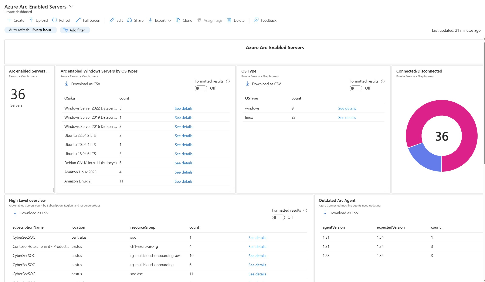
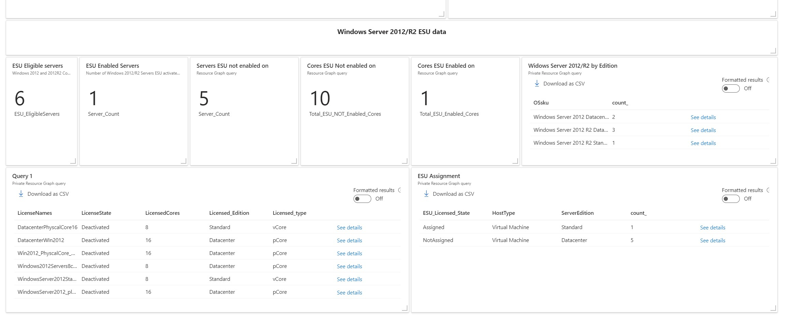
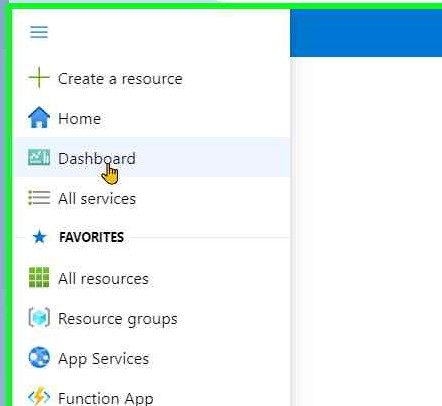
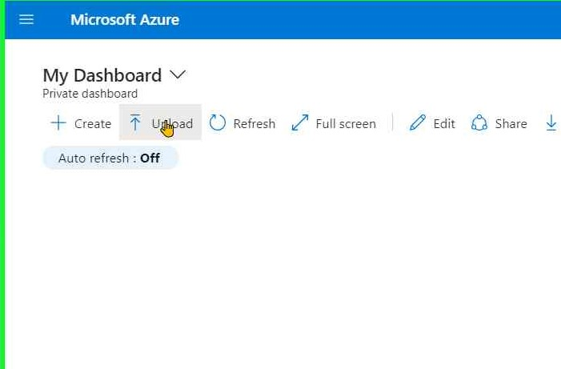
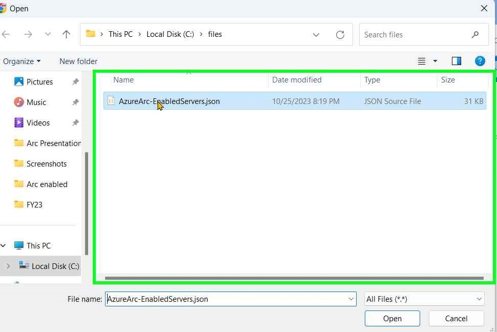
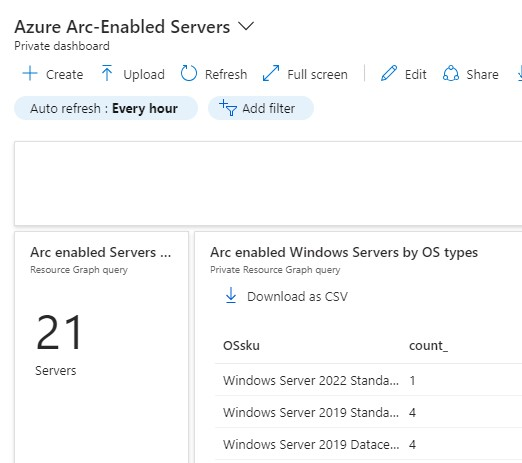

# Azure Arc-enabled Servers dashboard

This dashboard gives you an executive view of your Arc-enabled server environment. 
The  dashboard is broken into  __2 sections__; Arc-enabled Servers and Windows Server 2012/R2 ESU data. 
It's designed to be as simple as possible, yet give you enough information to review your environment in one simple glance

#### Arc-enabled Servers section
  * Breakdown and count of Arc-enabled servers within your tenant.
  * Servers are categorized by OS types and corresponding counts.
  * Distinction between Linux and Windows systems.
  * Status classification of servers as Connected (Online) or Disconnected (Offline).
  * Identification of outdated Azure-connected machine agents.
   
#### Windows Server 2012/R2 section
   * Monitoring ESU licenses activated and assigned.
 * Number of servers eligible for ESU.
 * Servers are categorized as enabled or not enabled for ESU deployment.
 * Server core counts enabled or not enabled for ESU deployment.
 * Enumeration of Windows Server 2012/R2 editions and their corresponding counts.
 * Tracking the activation states of ESU licenses, whether they are Activated or Deactivated.
 * Counting the ESU-licensed Cores/pCores and distinguishing between those that are Assigned and Not Assigned.
 * Tracking ESU assignments and activation counts.

## Dashboard file
  The dashboard is in JSON format and can be downloaded as a file here -->
  [Azure Arc-Enabled Servers](files/AzureArc-EnabledServers.json)

  ## How to use it?

Importing this  dashboard to your Azure environment.

Follow this steps:

* Download the dashboard json  a file here -->   [Azure Arc-Enabled Servers](files/AzureArc-EnabledServers.json)
* Login to [Azure Portal](https://portal.azure.com/) 
* Go to ___'Azure Dashboard'___

   
&NewLine;

* Click on ___'+ Upload'___

    
&NewLine;

* Select   ___'+ AzureArc-EnabledServers.json'___ file and click _'Open'_

   
&NewLine;

__The dashboard is ready for use!__

&nbsp;
   

### Disclaimer – Independent Community Tools

**These tools are provided "AS IS," without warranties or guarantees of any kind.**

These independently developed tools, scripts, dashboards and workbooks are **not an official Microsoft product or Microsoft-supported solution**. Microsoft does not provide support, maintenance, warranties, or guarantees for these tools or their outputs.

Monitoring results, deployment guidance and any assessment or migration recommendations are provided for informational and planning purposes only. Findings may not reflect the latest Azure capabilities, regional availability, pricing, retirement announcements, or Microsoft documentation.

**Before making production changes, users must independently validate, as applicable:**

- VM SKU compatibility and supported migration paths.
- Regional SKU availability and subscription quotas.
- Pricing and capacity requirements.
- VM generation, disk controller, NVMe, and storage compatibility.
- Redeployment, downtime, and migration requirements.
- Official Azure retirement dates and Microsoft documentation.

Users are solely responsible for validating assessment findings, evaluating potential operational impacts, and planning and executing changes within their environments.

**Use of these tools and reliance on its outputs are at the user's own risk.**
